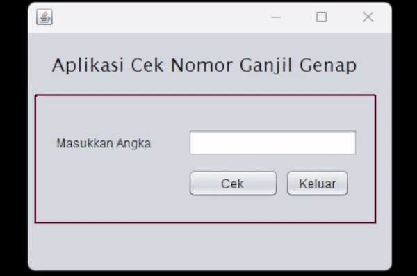

# Aplikasi Cek Nomor Ganjil Genap

Aplikasi sederhana berbasis GUI Java Swing yang dapat digunakan untuk mengecek apakah sebuah angka merupakan bilangan ganjil, genap, dan apakah angka tersebut merupakan bilangan prima.

## Fitur

- Mengambil input angka dari pengguna melalui `JTextField`.
- Menampilkan hasil apakah angka tersebut ganjil atau genap.
- Menampilkan apakah angka tersebut merupakan bilangan prima.
- Memvalidasi input agar hanya menerima angka (mengabaikan karakter lain).
- Menghapus input secara otomatis saat mendapat fokus.
- Terdapat tombol **Keluar** untuk menutup aplikasi.

## Cara Menggunakan Aplikasi

1. **Masukkan Angka**: Masukkan angka yang ingin Anda cek pada area teks yang disediakan.
2. **Klik Cek**: Klik tombol **Cek** untuk memeriksa apakah angka tersebut ganjil atau genap, serta apakah angka tersebut bilangan prima.
3. **Cek Hasil**: Hasil dari pengecekan (Ganjil/Genap dan Bilangan Prima) akan ditampilkan dalam dialog pop-up.
4. **Klik Keluar**: Jika Anda ingin menutup aplikasi, klik tombol **Keluar**.

## Prasyarat

Pastikan Anda memiliki hal berikut untuk menjalankan aplikasi:

- Java Development Kit (JDK) versi 8 atau lebih baru.
- IDE seperti NetBeans atau IntelliJ IDEA (opsional).
- Library Swing sudah termasuk dalam JDK, jadi tidak perlu dependensi tambahan.

## DEMO

